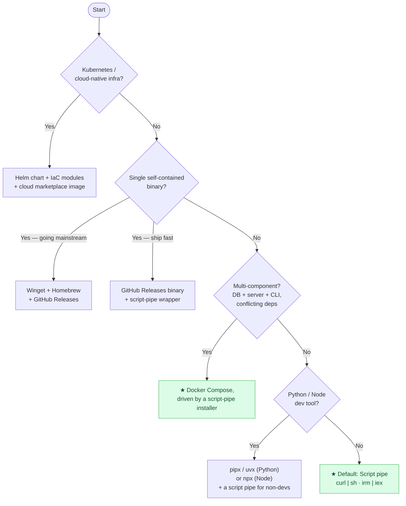

# Decision Guide: how to choose a method

You rarely pick **one** method forever. You pick a **primary** for now and a **roadmap** for later. This guide gets you to the right primary fast.

## Decision tree

## By scenario

### "I need a demo working this week" (MVP)
- **Primary:** [Script pipe](methods/script-pipe.md) that orchestrates [Docker Compose](methods/docker-compose.md).
- **Why:** zero registry/approval, cross-platform, the script can do checks + config + startup.
- **Watch:** you're asking users to trust an unseen script; use HTTPS + a clear repo.

### "Early adopters, still iterating, but want more trust"
- **Primary:** [Download → verify → run](methods/download-verify-run.md) with a **pinned release tag + published SHA256**.
- **Add:** [GitHub Releases](methods/github-releases-binaries.md) assets so installs are reproducible.

### "Mainstream Windows users"
- **Primary:** [Winget](methods/winget.md) (in-box on Windows 11).
- **Secondary:** [Scoop](methods/scoop.md) (devs), [Chocolatey](methods/chocolatey.md) (enterprise automation).
- **Needs:** a signed silent installer + manifest.

### "Mainstream macOS / Linux users"
- **Primary:** [Homebrew](methods/homebrew.md) — your own **tap** first, **core** later.
- **Add (Linux):** native [deb/rpm repos](methods/linux-native-packages.md), optionally [Snap/Flatpak](methods/snap-flatpak.md).

### "Cloud / platform product"
- **Primary:** [Helm](methods/helm-kubernetes.md) + [IaC modules & marketplace images](methods/iac-cloud.md).

## The "offer 2–3, not 10" rule

Maintaining a channel is ongoing work (new releases must flow to each). Pick:

1. **One zero-friction path** for everyone (script pipe / Docker).
2. **One native path per major OS** your users care about (Winget, Homebrew).
3. Optionally **one power-user path** (pipx/npx, source build).

More than that and channels rot. Track which you support in your README and automate releases to all of them (see [maturity roadmap](cross-cutting/maturity-roadmap.md)).

## Quick scoring heuristic

For each candidate, sum 1–5 on: *low friction*, *low prerequisites*, *orchestration power*, *trust*, *time-to-ship*, *low maintenance*. The highest total for **your audience and stage** wins. The [matrix](02-comparison-matrix.md) does this for the common cases.

Next: **[Comparison Matrix →](02-comparison-matrix.md)**
