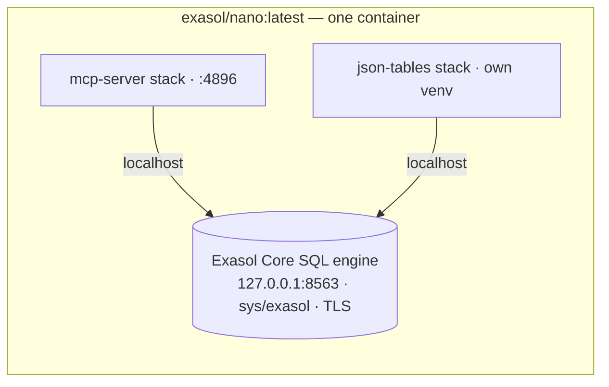

# Joining Nano + JSON Tables + MCP — the recommended method

This is the focused question: if the database is **Exasol Nano** (not Personal), what is the best way to ship **Nano + JSON Tables + MCP Server** as one thing, and why?

!!! success "Recommendation"
    **A one-command [script-pipe installer](../methods/script-pipe.md) that runs Nano with its native stacks** — the **built-in `mcp-server` stack** plus a **custom `json-tables` stack** — so the entire bundle lives inside a single Nano runtime:

    ```bash
    curl -fsSL https://example.com/install.sh | sh
    # → docker run … exasol/nano:latest --provision-stacks mcp-server,json-tables
    ```

    Everything (DB, MCP, JSON Tables) runs on `localhost` inside the Nano runtime. This is the smallest, most integrated option, it sidesteps the two hardest constraints, and it is the natural path toward folding into official Nano. The proven [Docker Compose](../methods/docker-compose.md) bundle is the ship-today fallback.

See [The components](components.md) for what each piece is.

---

## Why this is the right answer for Nano

Unlike the [Personal bundle](exasol-bundle.md) — where the database lives on the host and the tools must reach *up* to it — **Nano is a container with a runtime extension system built in**. That changes the best method entirely, because Nano already does most of the work:

- **MCP is already a first-class Nano stack.** `--provision-stacks mcp-server` makes Nano `pip install exasol-mcp-server` and serve it on `http://localhost:4896/mcp`, wired to the DB at `127.0.0.1:8563` with `sys`/`exasol`. Nothing to build.
- **Nano ships the toolchain JSON Tables needs.** Its built-in **`python`** and **`rust`** stacks provide `python3` + `cargo`/`rustc` — exactly what JSON Tables requires at runtime (it shells out to `cargo run`, with no PyPI wheel). So JSON Tables can be a **custom stack** that depends on `python,rust`.
- **One runtime, one network.** With all three inside Nano, every connection is `localhost`. That **eliminates the ingest reverse-connection caveat** (Exasol's HTTP transport connecting back to the JSON Tables client works trivially on the loopback) and removes any `host.docker.internal` plumbing.



_Provisioned at first start via `--provision-stacks`. Exposed ports: **8563** (SQL) · **8443** (UI) · **4896** (MCP)._

### How the two hard constraints are handled

1. **The `pyexasol` conflict** (JSON Tables needs `>=2.2,<3`, MCP needs `>=1,<2`). Each stack installs into its **own environment**: the `mcp-server` stack uses its dedicated site-packages, and the `json-tables` stack installs into its **own venv**. Different interpreters/site-paths → no clash, inside one container.
2. **JSON Tables' Rust-at-runtime coupling.** The `rust` stack provides `cargo` in the runtime, so the `json-tables` stack can build the ingest engine once at provision time (persisted in the `/exa` volume) and run it locally thereafter.

### Why a script pipe on top

Nano's `--provision-stacks` does the heavy lifting, but a thin [script-pipe installer](../methods/script-pipe.md) still adds what a bare `docker run` can't: a Docker prereq check, dropping the custom `json-tables` stack into the runtime's stack directory, port wiring, a `run-json-tables` helper, and an uninstaller. One line, any OS, ships today — for exactly the reasons in the [script-pipe write-up](../methods/script-pipe.md).

---

## End-user requirements

The defining advantage of this method: the host needs **only a container runtime**. Python, Rust, the MCP server, and JSON Tables are all installed *inside* Nano's runtime by the stacks — the host stays clean.

**Must have before installing:**

| Requirement | Why | Notes |
|-------------|-----|-------|
| **Docker or Podman** | Runs the Nano container + its stacks | Rootless OK; Docker Desktop on Windows/macOS works (Nano is a Linux container) |
| A supported host OS | To run the container runtime | Linux, macOS, or Windows; Nano image is `amd64` + `arm64` |
| **~2–4 GB free RAM** and a few GB disk | DB engine + the `/exa` data volume | `--shm-size` ≥ 512 MB (1 GB recommended) |
| **Free ports** 8563, 8443, 4896 | SQL, Web UI, MCP endpoint | (+ 8888/8866 if the Jupyter stack is enabled) |
| **Internet on first start** | Pull the image; stacks install apt/pip packages, build the Rust engine | Subsequent starts are offline-capable (cached in `/exa`) |
| `curl`+`sh` (mac/Linux) or `irm`+PowerShell (Windows) | To run the one-line installer | Both shells are in-box |

**Provisioned automatically — NOT host prerequisites:**

- :material-language-python: Python 3, :material-language-rust: Rust/`cargo`, the **MCP server** (`exasol-mcp-server`), and **JSON Tables** (built from source) — all installed inside the Nano runtime by the `python` / `rust` / `mcp-server` / `json-tables` stacks.

!!! note "First-start cost"
    The first `--provision-stacks` run is noticeably slower: it pulls the image, installs apt/pip packages, and **compiles the JSON Tables Rust engine once**. It's then cached in the `/exa` volume, so later starts are fast.

---

## Why not the alternatives

| Method | Verdict | Why |
|--------|---------|-----|
| **Nano stacks + script pipe** *(recommended)* | ✅ | One container; reuses Nano's built-in MCP + rust/python; localhost everywhere → no reverse-connection or `host.docker.internal`; smallest; upgradeable to official Nano. |
| **3-service [Docker Compose](../methods/docker-compose.md)** (nano image + mcp container + json-tables container) | ✅ Fallback | Proven and ships today (this is the `exasol-ai` bundle). Reverse-connection is fine because all three share one Docker network. But it **duplicates what Nano already provides** (a whole MCP container), maintains two extra Dockerfiles, and is heavier than enabling stacks. |
| **Separate containers against a host DB** | ⚠️ | This is the *Personal* shape, not Nano. Reintroduces the **ingest reverse-connection caveat** across the host/container boundary. Unnecessary when the DB is itself a container. |
| **Package managers** (Homebrew/Winget) | ⚠️ Later | Need registry approval *and* the user to already have the manager; can't orchestrate a multi-component DB runtime. Roadmap, not the critical path. |
| **Bake tools onto the Nano image at build time** | ❌ | Nano's image is **distroless** — no shell to `RUN apt`/`pip`. Build-time baking is impossible; the runtime stack system is the *intended* extension mechanism. |
| **Single mega-container from scratch** | ❌ | Re-implements what Nano already is, and you'd hit the `pyexasol` conflict in one env anyway. |

---

## The custom `json-tables` stack (the one piece to build)

The `mcp-server` stack ships with Nano; JSON Tables needs a small stack authored once, following Nano's stack contract (`stack_dependencies`, `stack_apt_packages`, `stack_pip_packages`, `stack_provision`, a launch hook). Sketch:

```sh
# ~/.exanano/provision/stacks/json-tables.sh   (native)
#   or mounted into the runtime's stack dir for Docker
stack_name()         { echo json-tables; }
stack_dependencies() { echo "python rust"; }          # cargo + python3 from built-in stacks
stack_apt_packages() { echo git; echo build-essential; }
stack_provision() {
  # isolate from the mcp-server stack's pyexasol<2
  python3 -m venv /opt/exanano/json-tables/venv
  . /opt/exanano/json-tables/venv/bin/activate
  git clone https://github.com/exasol-labs/exasol-json-tables /opt/exanano/json-tables/src
  pip install /opt/exanano/json-tables/src
  cargo build --release \
    --manifest-path /opt/exanano/json-tables/src/crates/json_tables_ingest/Cargo.toml
}
```

Then ingest runs in-runtime against `127.0.0.1:8563` — no reverse-connection problem. Once validated, this stack is a candidate to contribute upstream as an official Nano stack, at which point the bundle collapses to `--provision-stacks mcp-server,json-tables` with nothing custom at all.

!!! note "Validation status"
    The `mcp-server` stack is built into Nano and proven. The `json-tables` stack above is the part to author and test on a real Nano runtime (first provision compiles the Rust engine — slow once, then cached in `/exa`). Until that's validated, the **[Docker Compose `exasol-ai` bundle](exasol-bundle.md) is the working, ship-today fallback**.

---

## In one sentence

Because **Nano already carries an MCP stack and the rust/python toolchains**, the recommended way to join Nano + JSON Tables + MCP is to **extend Nano with stacks** (built-in `mcp-server` + a custom `json-tables`) behind a one-line script-pipe installer — one container, no reverse-connection or dependency-conflict workarounds, and a clean path into official Nano.

**Related:** [Script pipe](../methods/script-pipe.md) · [Docker Compose](../methods/docker-compose.md) · [The components](components.md) · [Exasol bundle case study](exasol-bundle.md)
