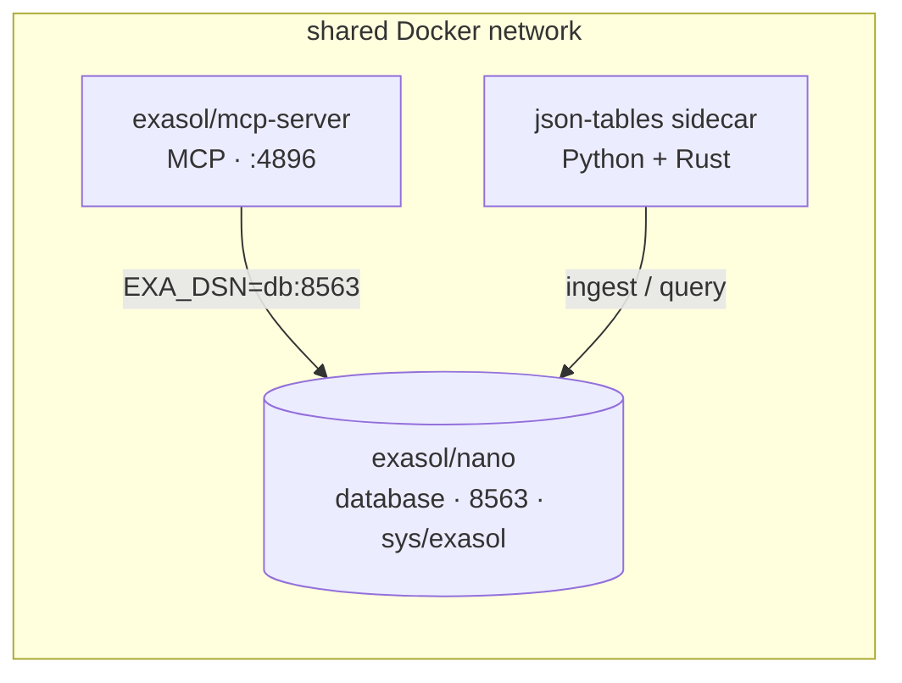

# Joining Nano + JSON Tables + MCP — the recommended method

The focused question: if the database is **Exasol Nano**, what is the best way to ship **Nano + JSON Tables + MCP Server** as one thing, and why?

!!! abstract "At a glance"
    **The database is a container**, so put everything in containers on one shared Docker network. `exasol-quickstart` (on any OS with Docker) runs **Exasol Nano + `exasol/mcp-server` + a JSON Tables sidecar** — *tested end-to-end, including ingest*. The single-container "stacks" idea is a **future** option, gated on the public Nano image (see [below](#the-future-one-container-via-nano-stacks)).

!!! success "Recommendation — works today (tested)"
    A one-command installer that runs **published containers on a shared Docker network**: **Exasol Nano** (`exasol/nano:latest`, the database) + the official **`exasol/mcp-server:latest`** image (MCP sidecar) + a **JSON Tables sidecar** (built from source). This is exactly what the bare `exasol-quickstart` does on any OS with Docker — verified end-to-end, including ingest:

    ```bash
    pipx install exasol-quickstart
    exasol-quickstart
    # creates a Docker network, then:
    #   exasol/nano:latest             → DB on 127.0.0.1:8563 (sys/exasol)
    #   exasol/mcp-server:latest        → MCP on 127.0.0.1:4896, EXA_DSN=<db>:8563
    #   json-tables sidecar (built once) → exasol-quickstart json-tables …
    ```

    All containers share one Docker network, so MCP reaches the DB by service name and — when JSON Tables is added as a sidecar — its ingest reverse-connection works **in-network**.

!!! warning "Why not Nano's “stacks”? (not in the public image yet)"
    Nano's **dev source** has an elegant `--provision-stacks` system — a built-in `mcp-server` stack plus `python`/`rust` stacks — that would let the whole bundle live inside **one** Nano container. **It is not in the published `exasol/nano:latest` yet.** Verified by testing: `--provision-stacks` / `--list-stacks` are silently appended to the DB parameters and ignored, and MCP never starts. So today the working method is the **sidecar/Compose** approach above; the single-container stack design is the cleaner **future** ([see below](#the-future-one-container-via-nano-stacks)).

See [The components](components.md) for what each piece is.

---

## Why this works for Nano

Because **Nano is itself a container**, all the pieces can sit on one Docker network and reach the database over it — which sidesteps the two hardest constraints:

- **MCP ships as a published image.** `exasol/mcp-server:latest` runs with `EXA_DSN=<db>:8563`, `EXA_USER=sys`, `EXA_PASSWORD=exasol`, `EXA_SSL_CERT_VALIDATION=false`, `--host 0.0.0.0 --port 4896 --no-auth`. Nothing to build — just pull and run it next to Nano.
- **Shared network kills the reverse-connection caveat.** JSON Tables' bulk ingest uses Exasol's HTTP transport (the DB connects *back* to the client). When the DB and the JSON Tables sidecar are on the **same Docker network**, that reverse connection resolves by service name — no `host.docker.internal`, no host/container boundary.
- **The `pyexasol` conflict dissolves across containers.** MCP needs `pyexasol >=1,<2`; JSON Tables needs `>=2.2,<3`. In **separate containers** (separate images) they never share a Python environment.



_Host ports: **8563** (SQL) · **8443** (UI) · **4896** (MCP). MCP + DB are published images; the JSON Tables sidecar is built from source (it has no wheel and needs a Rust toolchain)._

### Why a one-command installer on top

A bare `docker run` / compose file can't do prerequisite checks, port wiring, health waits, helper scripts, or uninstall. The [`exasol-quickstart`](recommended-approach.md) front door adds all of that — one line, any OS with Docker, ships today.

---

## End-user requirements

The host needs **only a container runtime** — the DB and MCP are pulled as published images; nothing else lands on the host.

| Requirement | Why | Notes |
|-------------|-----|-------|
| **Docker or Podman** | Runs Nano + the MCP sidecar (+ JSON Tables sidecar) | Rootless OK; Docker Desktop on any OS (Nano is a Linux container) |
| ~**2–4 GB RAM** + a few GB disk | DB engine + the `/exa` data volume | `--shm-size` ≥ 512 MB (1 GB recommended) |
| **Free ports** 8563, 8443, 4896 | SQL, Web UI, MCP | |
| **Internet on first run** | Pull `exasol/nano` + `exasol/mcp-server`; build the JSON Tables sidecar | DB + MCP are just pulls; JSON Tables compiles its Rust engine once |

Not required on the host: Python, Rust, or the tools themselves — they live in the containers.

---

## Why not the alternatives

| Method | Verdict | Why |
|--------|---------|-----|
| **Published containers on a shared network** *(recommended, works today)* | ✅ | Nano + `exasol/mcp-server` (pull, no build) + a JSON Tables sidecar; in-network so ingest + service discovery just work; deps isolated per container. This is what the bare `exasol-quickstart` ships. |
| **Single container via Nano stacks** | ⏳ Not yet | The cleanest end-state, but **`--provision-stacks` isn't in the public `exasol/nano:latest`** (verified). Revisit when Nano ships the stack system — see below. |
| **Separate containers against a *host* DB** | ⚠️ | That's the *Personal* shape, where the reverse-connection caveat bites across the host/container boundary. With Nano the DB is itself a container, so keep everything in-network. |
| **Bake the tools onto the Nano image** | ❌ | Nano's image is **distroless** — no shell to `RUN apt`/`pip`. Build-time baking is impossible. |
| **Package managers** (Homebrew/Winget) | ⚠️ Later | Need registry approval *and* the user to already have the manager; can't orchestrate a multi-container runtime. |

---

## The future: one container via Nano stacks

When the public Nano image ships the stack system, this bundle collapses from three containers to **one**: `--provision-stacks mcp-server,json-tables` would install the MCP server and a JSON Tables stack *inside* Nano's runtime, all on `localhost`. The MCP stack already exists in Nano's source; JSON Tables would be a small custom stack:

```sh
# a future Nano stack — not usable until the public image supports --provision-stacks
stack_name()         { echo json-tables; }
stack_dependencies() { echo "python rust"; }      # built-in stacks provide cargo + python3
stack_provision() {
  python3 -m venv /opt/json-tables/venv            # isolate from the mcp-server stack's pyexasol<2
  . /opt/json-tables/venv/bin/activate
  git clone https://github.com/exasol-labs/exasol-json-tables /opt/json-tables/src
  pip install /opt/json-tables/src
  cargo build --release --manifest-path /opt/json-tables/src/crates/json_tables_ingest/Cargo.toml
}
```

Until then, the sidecar method is the recommendation.

!!! note "Status"
    **Tested (`exasol-quickstart` 0.3.x):** the bare command brings up Nano + MCP + the **JSON Tables sidecar** — MCP reports healthy and `ingest-and-wrap` succeeds end-to-end. The single-container **stack** path waits on the public Nano image.

---

## In one sentence

Because **Nano is a container**, the way to join Nano + JSON Tables + MCP that works *today* is **published containers on a shared Docker network** — Nano + `exasol/mcp-server` + a JSON Tables sidecar — behind one installer command; the single-container “stacks” design is the cleaner future once it lands in the public image.

**Related:** [Recommended approach](recommended-approach.md) · [The components](components.md) · [Docker Compose](../methods/docker-compose.md) · [Personal + JSON Tables + MCP](personal-jsontables-mcp.md)
