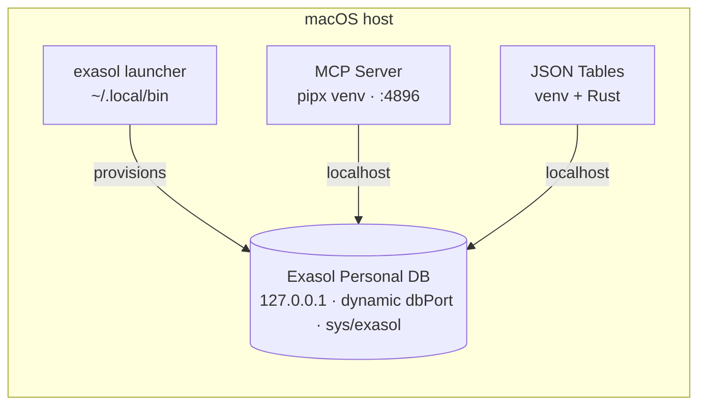

# Joining Exasol Personal + JSON Tables + MCP — the recommended method

Same three-way bundle, but with **Exasol Personal** as the database instead of [Nano](nano-jsontables-mcp.md). That one swap changes the best method, because **Personal is not a container — it's a host launcher** that provisions a real Exasol DB (a managed VM locally on macOS Apple-Silicon, or a cloud instance via OpenTofu).

!!! warning "Roadmap — not built yet"
    This page describes the **planned macOS path** for the [`exasol-quickstart`](recommended-approach.md) front door. It is **not implemented in the tool yet** — today `exasol-quickstart` ships only the [Nano + MCP via Docker](nano-jsontables-mcp.md) path. This is the design we'll build for `exasol-quickstart --base personal` on macOS.

!!! success "Recommendation (planned)"
    **The same `exasol-quickstart` command, co-locating everything on the host**: it lets the **Personal launcher** provide the database, then installs **MCP Server** and **JSON Tables** as **isolated host environments** ([pipx](../methods/python-pip-pipx-uvx.md) for MCP, a dedicated venv + Rust toolchain for JSON Tables) — all talking to the DB over `127.0.0.1`.

    ```bash
    pipx install exasol-quickstart
    exasol-quickstart --base personal        # macOS (Apple Silicon) — planned
    #  under the hood:
    #  1. exasol install local            → DB on 127.0.0.1:<dbPort>
    #  2. exasol info --json               → discover dsn / port / password
    #  3. pipx install exasol-mcp-server   → MCP on :4896 (own venv)
    #  4. venv + cargo build json-tables   → CLI against 127.0.0.1 (own venv)
    ```

    Co-locating the tools with the DB on `localhost` is the key move — it makes JSON Tables' bulk ingest work and removes the host/container boundary entirely.

See [The components](components.md) for what each piece is, and the [Recommended approach](recommended-approach.md) for the single front door across all platforms.

---

## The one constraint that decides everything

JSON Tables' bulk **ingest uses Exasol's HTTP transport, where the database connects *back* to the client**. That reverse connection only works reliably when **JSON Tables shares a network with the database**:

- ✅ **Same host (`localhost`)** — DB on the host, JSON Tables on the host → trivial.
- ✅ **Same Docker network** — the all-container [Nano answer](nano-jsontables-mcp.md).
- ⚠️ **Across a host/container boundary** — DB on host, JSON Tables in a container reached via `host.docker.internal` → the DB often can't connect back into the container. Ingest is fragile; `wrap`/`describe`/query still work.

With Personal the database lives **on the host**, so the clean way to satisfy that constraint is to **put the tools on the host too**. This is the single biggest reason the Personal method differs from the Nano one.

> MCP Server has no such issue — it only makes **outbound** connections to the DB — so MCP could run in a container if you prefer. JSON Tables is the piece that must sit next to the database.

---

## Recommended architecture



_Connection (dsn / port / password) discovered via `exasol info --json`._

### How the hard constraints are handled

1. **`pyexasol` conflict** (JSON Tables `>=2.2,<3` vs MCP `>=1,<2`): each tool gets its **own environment** — `pipx` puts MCP in an isolated venv; JSON Tables gets a separate venv. No shared interpreter, no clash — and no containers required.
2. **JSON Tables' Rust-at-runtime coupling**: install a host **Rust toolchain** (rustup) once; the venv builds the `cargo` ingest engine and runs it locally.
3. **Dynamic connection**: the local DB port is assigned at deploy time, so the installer reads it from **`exasol info --json`** (+ `secrets.json` for the password) and injects it into both tools — never hardcoded.

### Why the `exasol-quickstart` front door

The [`exasol-quickstart`](recommended-approach.md) command is what would turn these four manual steps into one line: install the launcher, ensure a local deployment exists, discover the connection, set up the two isolated environments, and start MCP — plus a `run-json-tables` helper and an uninstaller. (Note: Personal's **local** mode is macOS Apple-Silicon only; the launcher itself is cross-platform for cloud targets.)

---

## End-user requirements

The trade-off vs the [Nano method](nano-jsontables-mcp.md) is inverted: here you need **no Docker**, but the tools run on the host, so the host must carry **Python and a Rust toolchain**.

**Must have before installing (local / macOS):**

| Requirement | Why | Notes |
|-------------|-----|-------|
| **macOS on Apple Silicon**, ≥ 8 GB RAM | Personal's `local` mode is gated to `darwin/arm64` | The launcher runs the DB in a managed VM |
| **Xcode Command Line Tools** | C compiler/linker + `git` to build the JSON Tables Rust engine | `xcode-select --install` |
| **Python 3.10+** | Runtime for both MCP and JSON Tables (separate venvs) | Ships with CLT / Homebrew |
| **Rust toolchain** (`rustup` → `cargo`) | JSON Tables shells out to `cargo` at ingest | Installer can bootstrap it |
| **`pipx`** | Isolates the MCP install from the JSON Tables venv | Installer can bootstrap it |
| **`~/.local/bin` on `PATH`** | Where the `exasol` launcher installs | Add it if missing |
| **Free ports**: DB port (~8563) + 4896 | SQL + MCP endpoint | DB port is assigned dynamically; discovered via `exasol info --json` |
| **Disk + RAM for the VM** | Default ~100 GB data disk (configurable); ≥ 4 GB VM RAM | Plus the two small venvs |
| **Internet access** | Launcher + VM image, pip packages, `cargo` crates, `git clone` | First `exasol install local` takes ~10–20 min |

**Notably NOT required:** Docker/Podman — everything runs as host processes alongside the launcher's own VM.

**Provisioned by the installer:** the `exasol` launcher, the local DB (`exasol install local`), the two isolated environments (`pipx` MCP + JSON Tables venv), and the connection wiring (discovered via `exasol info --json`).

!!! warning "Cloud variant"
    Pointing at a **cloud** Personal DB instead needs a provider account + credentials (AWS / Azure / Exoscale / STACKIT); OpenTofu is auto-downloaded. But the **ingest reverse connection generally can't reach your laptop** from a cloud DB — use `local` for ingest-heavy work, or run JSON Tables on a host the DB can reach.

---

## Why not the alternatives

| Method | Verdict | Why |
|--------|---------|-----|
| **Host-co-located tools + script pipe** *(recommended)* | ✅ | Everything on `localhost` → ingest works; `pipx`/venv resolves the dependency conflict cleanly; no Docker or `host.docker.internal` needed. |
| **Host DB + two containers** (`host.docker.internal`) | ⚠️ Works, with a caveat | This is the existing `exasol-personal-ai` bundle. MCP is fine, but **JSON Tables ingest hits the reverse-connection problem** across the host/container boundary — so that bundle documents a *host-mode fallback* for ingest. The recommended method simply makes host-mode the **default** for JSON Tables. |
| **Hybrid: MCP container + JSON Tables on host** | ✅ Acceptable | Valid middle ground — MCP only needs outbound, so a container is fine; JSON Tables stays on the host where ingest works. Slightly less uniform than all-host. |
| **Containerize the Nano way** | ❌ N/A | Personal isn't Nano and isn't a container — its DB is on the host. So the [Nano sidecar/Compose approach](nano-jsontables-mcp.md) doesn't apply here. (And Nano's own "stacks" aren't in the public image yet anyway.) |
| **Cloud Personal + tools** | ⚠️ Limited | For a cloud DB, `wrap`/query/MCP work over the remote DSN, but **ingest's reverse connection generally can't reach your laptop**. Run JSON Tables on a host the DB can reach, or use **local** Personal for ingest-heavy work. |

---

## Relationship to the `exasol-personal-ai` bundle

The existing `exasol-personal-ai` bundle implements the **two-container** shape (host DB + MCP and JSON Tables containers via `host.docker.internal`) and already documents the host-mode fallback for ingest. The recommendation here is the natural refinement: **keep JSON Tables on the host by default** so ingest "just works," and optionally containerize only MCP. Same discovery (`exasol info --json`), same one-command UX — just the tool placement that the reverse-connection constraint argues for.

## Nano vs Personal — the unifying principle

| | Database is… | Best method | Host must have |
|---|---|---|---|
| **[Nano](nano-jsontables-mcp.md)** | a container | **sidecar containers** on a shared network — Nano + `exasol/mcp-server` (+ JSON Tables) | **Docker/Podman** only (the tools are images, not host installs) |
| **Personal** *(this page)* | a host launcher | co-locate tools **on the host** (pipx/venv) | **Python + Rust** on the host (no Docker); macOS Apple-Silicon |

Both reduce to the same rule: **put JSON Tables wherever it shares `localhost` with the database** — because of the HTTP-transport reverse connection. MCP, being outbound-only, is flexible either way.

---

## In one sentence

Because **Exasol Personal puts the database on the host**, the planned way to join Personal + JSON Tables + MCP is the one `exasol-quickstart` command **installing both tools as isolated host environments next to that DB** (pipx for MCP, a venv + Rust for JSON Tables), so ingest works on `localhost` and the `pyexasol` conflict is resolved without containers. (Roadmap — today the tool ships the [Nano + MCP via Docker](nano-jsontables-mcp.md) path.)

**Related:** [Recommended approach](recommended-approach.md) · [The components](components.md) · [Nano + JSON Tables + MCP](nano-jsontables-mcp.md) · [pip / pipx / uvx](../methods/python-pip-pipx-uvx.md)
