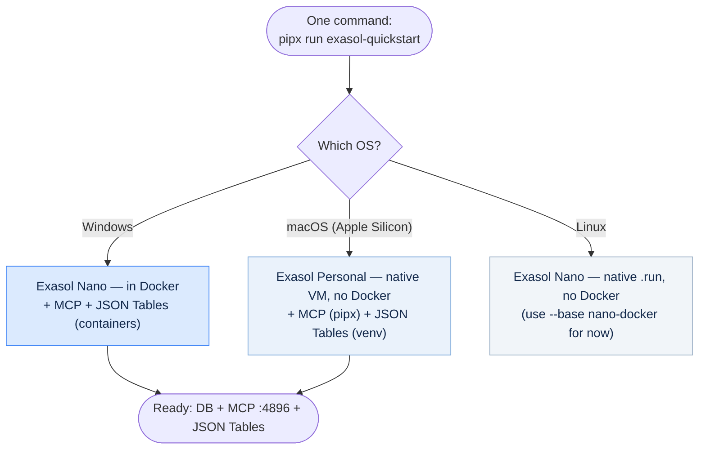
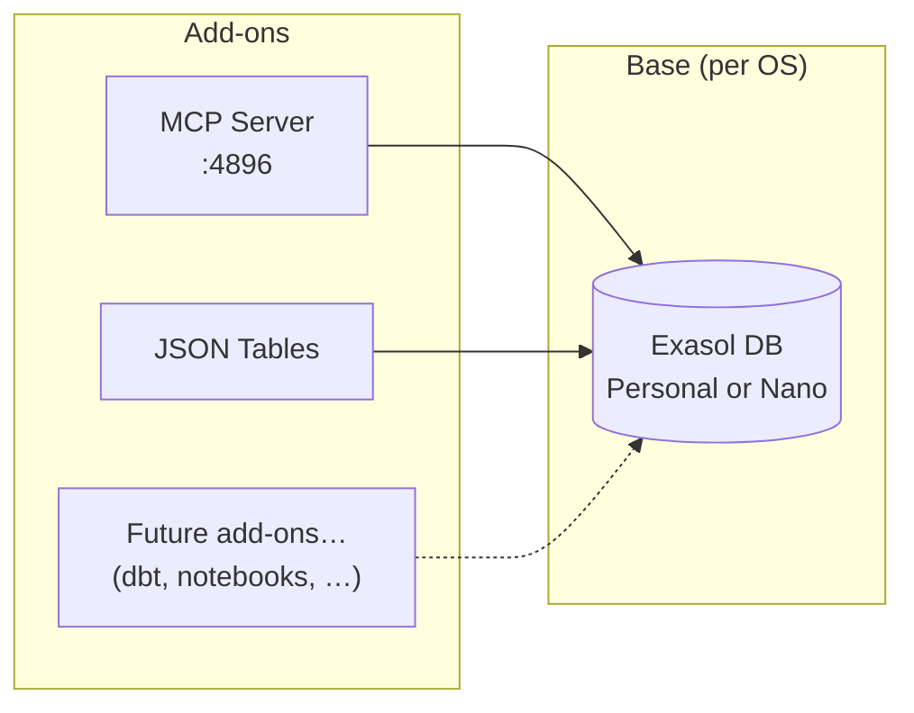

# ★ Recommended approach

> **The single best way to put "Exasol + AI add-ons" on a user's machine with one command — designed around end-user simplicity.**

!!! abstract "At a glance"
    **One command** stands up Exasol + AI for the user:

    *Try it* — nothing installed:

    ```bash
    pipx run exasol-quickstart
    ```

    *Keep it* — run it again later:

    ```bash
    pipx install exasol-quickstart && exasol-quickstart
    ```

    - **What you get** — an Exasol **database** (`:8563`), an **MCP server** (`:4896/mcp`) for LLM access, and **JSON Tables** (JSON → SQL).
    - **Only universal prerequisite** — Python 3.9+ with `pipx` (or `uv`). **Docker is per-OS, not universal.**
    - **How it runs** — auto-selected **by OS**: **Windows** → Nano in Docker (*tested*); **macOS** → Exasol Personal native VM (*experimental*); **Linux** → Nano native (*roadmap* — use `--base nano-docker` for now).
    - **Where it lives** — published on PyPI as [`exasol-quickstart`](https://pypi.org/project/exasol-quickstart/) (`0.3.14`), built and released via Trusted Publishing.

## The goal

The end user is a **data scientist or data analyst** who wants to *try Exasol* with as little setup as possible. This is a **promotion / adoption** play: the easier the first run, the more people experience what Exasol can do.

So the design targets are, in priority order:

1. **One command.** Run it → you have a working Exasol **plus** the add-ons (no "install the base, then follow a multi-step add-on guide").
2. **Minimal prerequisites.** Don't demand Docker. Don't demand Node.js. **Python is fair to assume** — this audience almost always has it.
3. **Any OS.** Windows, Linux, or macOS.
4. **One unified, scalable model.** Adding a *future* add-on later must not need a new install mechanism.

---

## The recommendation, in one line

**A single Python-launched front-door command that detects the platform, provisions the right Exasol base for that OS, and layers the add-ons — in one shot.**

Python is the front door because the target audience already has it, it behaves identically on every operating system, and it can *orchestrate* — detect the OS, provision the base, wire up connections, and start services — which a bare package install or `docker run` cannot.

## Try it today

The tool is published on PyPI as [`exasol-quickstart`](https://pypi.org/project/exasol-quickstart/); the source is on [GitHub](https://github.com/krishna-exasol/exasol-quickstart).

Pick the form that fits — **try it** (runs once, nothing installed) or **keep it** (installs the command for repeated use). Each block has its own copy button.

**▶️ Try it** — runs once, nothing installed:

```bash
pipx run exasol-quickstart
```

…or, with `uv`:

```bash
uvx exasol-quickstart
```

**📌 Keep it** — installs the command so you can run it again later:

```bash
pipx install exasol-quickstart && exasol-quickstart
```

…or, with `uv`:

```bash
uv tool install exasol-quickstart && exasol-quickstart
```

The only universal prerequisite is **Python 3.9+ with `pipx`** (or `uv`). Once the stack is up: database on `127.0.0.1:8563` (`sys` / `exasol`), MCP at `http://127.0.0.1:4896/mcp`. Stop it with `docker rm -f exasol-quickstart-db exasol-quickstart-mcp exasol-quickstart-json-tables`.

!!! info "Release status"
    | Version | What it does |
    |---------|--------------|
    | **`0.3.14`** *(current)* | The bare command **auto-selects the base by OS** — **Windows** → Nano (Docker), **macOS** → Exasol Personal, **Linux** → Nano native. The **Windows / Docker** bundle (Nano + MCP + JSON Tables) is **tested end-to-end, including ingest**. Try via `pipx run` / `uvx`, or keep via `pipx install`. |
    | next | **Validate the macOS Personal path** end-to-end, and **build the Linux native `.run`** path. Until then, `--base nano-docker` runs the tested container bundle on macOS/Linux too. |

    It's the evolution of the `exasol-ai` and `exasol-personal-ai` bundles into one lower-prerequisite front door. Releases publish to PyPI automatically via GitHub Releases (Trusted Publishing). The only universal prerequisite is **Python 3.9+ with `pipx`**.

---

## How it decides — by operating system

`exasol-quickstart` picks the **base by OS** — each platform's most native option — then layers MCP and JSON Tables on it. Docker availability does not change the choice; use `--base` to override (e.g. `--base nano-docker` to force the container bundle on any OS).



> **Status by OS** — **Windows** (Nano in Docker) is **tested end-to-end, including ingest**. **macOS** (Exasol Personal native VM) is **experimental — not yet validated**. **Linux** (native Nano `.run`) is **on the roadmap**; for now, run `exasol-quickstart --base nano-docker` to use the tested container bundle.

**Why the base differs by OS** — the Exasol engine is Linux-native, so the no-Docker local option differs per platform: macOS runs it in a native VM (Exasol Personal); Linux installs it natively from the `.run`; Windows has no native engine, so it runs Nano in Docker.

---

## What runs, by OS

| OS | Base | Add-ons | Docker? | Status |
|----|------|---------|---------|--------|
| **Windows** | Exasol Nano (Docker) | MCP + JSON Tables as **sidecar containers** | ✅ Yes | ✅ **tested** |
| **macOS** (Apple Silicon) | **Exasol Personal** (native VM) | MCP via `pipx` + JSON Tables venv on the host | ❌ No | 🧪 experimental |
| **Linux** | Exasol Nano (native `.run`) | host processes | ❌ No | 🛣️ roadmap |

Any OS can force the tested **container bundle** with `exasol-quickstart --base nano-docker` (requires Docker) — published images (`exasol/nano` + `exasol/mcp-server`) plus a JSON Tables sidecar, no host Python/Rust needed.

> **No-Docker Windows alternative:** point the same command at a **cloud** Exasol Personal deployment (needs a provider account). Good for browsing/querying, but JSON Tables *ingest* can't reverse-connect to a laptop from the cloud — see the [Personal case study](personal-jsontables-mcp.md#the-one-constraint-that-decides-everything).

---

## The unifying principle: **add-ons as isolated units**

The reason this scales is that the **unit of bundling is an add-on**, and each add-on is an **isolated unit** wired to the base:

- **Today** — a **sidecar container** (when the base is Nano, in Docker) or an **isolated host environment** (`pipx`/venv, when the base is Personal on the host).
- **Tomorrow** — once the public Nano image ships the `--provision-stacks` system, an add-on becomes a **stack inside the Nano container** (the `mcp-server` stack already exists in Nano's source). Same idea, even simpler.

Either way the front-door command just **installs the base and turns on the requested add-ons**.



**Why this is reliable and scalable:**

- **Reliable** — each add-on lives in its own environment (a sidecar container, or an isolated host venv), so the `pyexasol` conflict (JSON Tables `>=2.2,<3` vs MCP `>=1,<2`) never bites; and because add-ons sit next to the DB (a shared Docker network, or `localhost`), JSON Tables' reverse-connection ingest just works.
- **Scalable** — a *new* add-on later (dbt, a notebook server, another connector) is **just one more sidecar/recipe**. The base, the front door, and the user's one command don't change.
- **Strategic end-state** — Personal's local DB is Nano under the hood, so the cleanest future is to **expose the same stack model on Personal too**. Then "add-on = stack" on *every* base and OS, behind the same single command.

---

## What the user gets

After the one command:

- An **Exasol database** on `localhost` (`:8563`, `sys` / `exasol`).
- The **MCP server** at `http://localhost:4896/mcp` — point Claude or any MCP client at it to talk to the database in natural language (read-only by default).
- the **JSON Tables** CLI (`exasol-quickstart json-tables …`) to ingest JSON and query it as SQL.

…enough to actually *feel* what Exasol can do for AI/analytics in minutes.

---

## The combinations — pros & cons

| Bundle | What you get | Best for | Pros | Cons |
|--------|--------------|----------|------|------|
| **Nano + MCP** *(ships today)* | DB + LLM access | Fast "talk to my DB" demo | Two published images (no build); nothing on the host but Docker | Docker required; no JSON ingest |
| **Nano + JSON Tables** | DB + JSON→SQL | JSON analytics demo | In-network ingest (shared Docker network); deps isolated | Docker required; JSON Tables sidecar builds from source |
| **Nano + MCP + JSON Tables** *(ships today)* | DB + LLM + JSON | The complete "try Exasol for AI" | In-network; each tool its own container; no host deps | Docker required; first run builds the JSON Tables sidecar once |
| **Personal + MCP** | Real Personal DB + LLM | Mac users who want *Personal* specifically | No Docker (native VM); real Personal experience | macOS-only; tools run as host processes |
| **Personal + MCP + JSON Tables** | Personal + LLM + JSON | Full Mac experience | No Docker; ingest works (host localhost) | macOS-only; host needs Python + Rust |

---

## Requirements we expect the user to have

**Universal (all OSes):**

- **Python 3.9+ with `pipx`** (or `uv`) — to launch the front door. The data-scientist audience reliably has it.
- **Internet** on first run; ~**4 GB free RAM** and a few GB disk.

**By route:**

| Route | Extra prerequisites | Provided automatically | Status |
|-------|--------------------|------------------------|--------|
| **Docker** (any OS: Windows / Linux / macOS) | **Docker** installed and running | DB + MCP as published images on a shared network; JSON Tables sidecar built from source — **no host Python/Rust needed** | ✅ tested |
| **macOS native** (no Docker) | Xcode Command Line Tools (compiler + `git`); ≥ 8 GB RAM | the `exasol` launcher + local DB, MCP via `pipx`, JSON Tables venv + Rust (rustup) | 🧪 experimental |
| **Linux native** (no Docker) | the Nano `.run`; Python + Rust for the add-ons | DB native; MCP via `pipx`; JSON Tables via venv | 🛣️ roadmap |

**The one irreducible add-on requirement:** JSON Tables needs a **Rust toolchain** at runtime (it has no PyPI wheel and shells out to `cargo`). On the Docker route this is *fully inside the container* (nothing on the host); on the native routes it's installed via `rustup`. The clean long-term fix is a prebuilt JSON Tables wheel upstream, after which even that disappears.

---

## Honest constraints & roadmap

- **Windows local needs Docker.** Exasol's engine is Linux-native; there's no way around a container (or cloud) on Windows. We make it one command and detect/guide Docker, but we don't pretend it's absent.
- **JSON Tables packaging.** No wheel + `cargo`-at-runtime is the rough edge. Short term: provision Rust for the user. Long term: push upstream for a prebuilt wheel.
- **Unify the stack model across Personal + Nano.** The biggest scalability win: make Personal accept the same "stacks" as Nano, so one add-on mechanism covers every base and OS.

---

## Where this fits with the original bundles

- [`exasol-ai`](exasol-ai.md) (Nano, Docker Compose) and [`exasol-personal-ai`](exasol-personal-ai.md) (Personal, host launcher + containers) were the original, separate bundles — now archived case studies.
- This page is the **unified front door** that replaced them: a native base **per OS**, add-ons as containers or host environments, all behind **one Python command** — reliable, scalable, and as simple as possible for the user.

**Related:** [The components](components.md) · [Nano + JSON Tables + MCP](nano-jsontables-mcp.md) · [Personal + JSON Tables + MCP](personal-jsontables-mcp.md) · [Script pipe](../methods/script-pipe.md) · [pip / pipx / uvx](../methods/python-pip-pipx-uvx.md)
