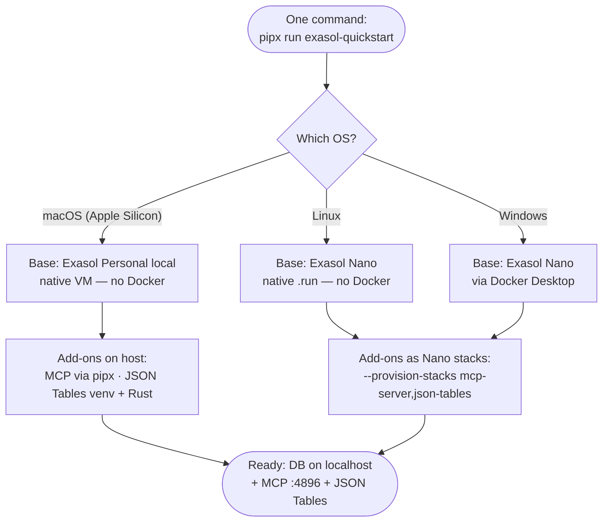
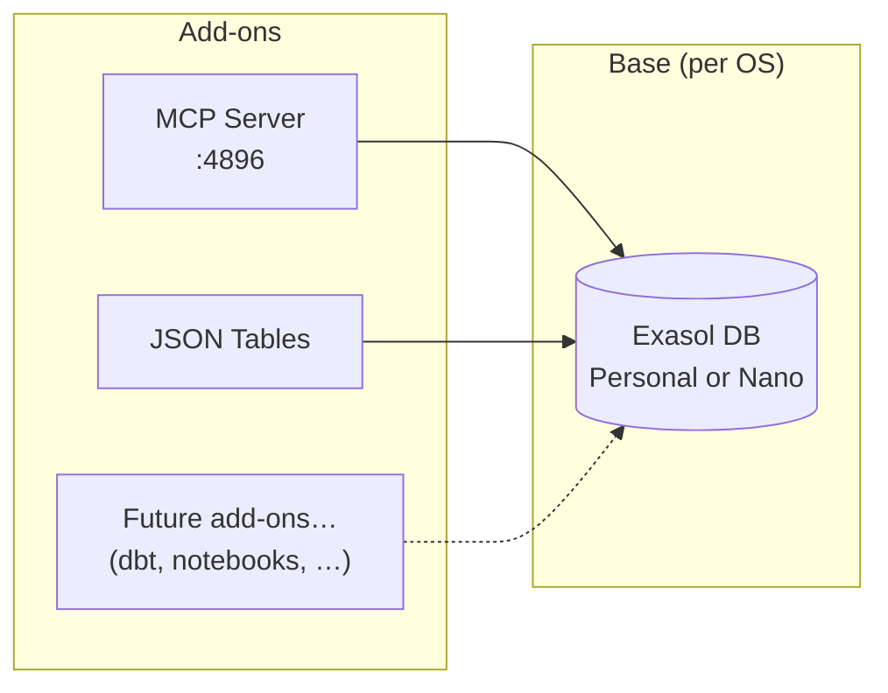

# ★ Recommended approach

> **The single best way to put "Exasol + AI add-ons" on a user's machine with one command — designed around end-user simplicity.**

## The goal

The end user is a **data scientist or data analyst** who wants to *try Exasol* with as little setup as possible. This is a **promotion / adoption** play: the easier the first run, the more people experience what Exasol can do.

So the design targets are, in priority order:

1. **One command.** Run it → you have a working Exasol **plus** the add-ons (no "install the base, then follow a multi-step add-on guide").
2. **Minimal prerequisites.** Don't demand Docker. Don't demand Node.js. **Python is fair to assume** — this audience almost always has it.
3. **Any OS.** Windows, Linux, or macOS.
4. **One unified, scalable model.** Adding a *future* add-on later must not need a new install mechanism.

---

## The recommendation, in one line

**A single Python-launched front-door command that detects the platform, installs the right Exasol base for that OS, and layers the requested add-ons — in one shot.**

```bash
pipx install exasol-quickstart            # then run:  exasol-quickstart
pipx run exasol-quickstart                # or zero-install
exasol-quickstart --with json-tables      # base + MCP + JSON Tables (planned)
```

Python is the front door because the audience already has it, it runs the same on every OS, and it can *orchestrate* (detect OS, install the base, wire connections, start services) — which a bare package install or `docker run` cannot. A `curl … | sh` / `irm … | iex` one-liner can bootstrap the same tool for users who'd rather not touch Python directly.

!!! success "Published on PyPI"
    The command is **live**: [`exasol-quickstart`](https://pypi.org/project/exasol-quickstart/) is on PyPI (a `0.0.1` preview), so `pipx install exasol-quickstart` already resolves. Source: [github.com/krishna-exasol/exasol-quickstart](https://github.com/krishna-exasol/exasol-quickstart). It's the evolution of the `exasol-ai` and `exasol-personal-ai` bundles into one lower-prerequisite front door — the full platform-aware installer (per the graph below) is in progress.

---

## How it adapts per OS — the decision graph



**Why the base differs by OS** — the Exasol engine is Linux-native, so the *no-Docker* local option is different on each platform:

- **macOS (Apple Silicon)** → **Exasol Personal local** runs the DB in a native VM, no Docker.
- **Linux** → **Exasol Nano** installs natively from its `.run`, no Docker.
- **Windows** → there is **no native Windows engine**, so a local DB means **Nano in Docker** (Docker Desktop / WSL2). The honest exception to "no Docker."

---

## Per-OS recommendation — "this is the way"

| User's OS | Recommended base | How the base installs | How add-ons install | Docker needed? | Host needs |
|-----------|------------------|-----------------------|---------------------|----------------|------------|
| **macOS** (Apple Silicon) | **Exasol Personal** (local) | `exasol install local` (native VM) | host: `pipx` MCP + venv JSON Tables | ❌ No | Python + Rust (Xcode CLT) |
| **Linux** | **Exasol Nano** (native `.run`) | native installer | **Nano stacks** | ❌ No | nothing beyond the installer¹ |
| **Windows** | **Exasol Nano** (Docker) | `docker run exasol/nano` | **Nano stacks** | ✅ Yes (only local option) | Docker Desktop |

¹ On Nano, the `python` / `rust` / `mcp-server` / `json-tables` stacks self-provision inside the runtime — the host doesn't need Python or Rust.

> **No-Docker Windows alternative:** point the same command at a **cloud** Exasol Personal deployment (needs a provider account). Good for browsing/querying, but JSON Tables *ingest* can't reverse-connect to a laptop from the cloud — see the [Personal case study](personal-jsontables-mcp.md#the-one-constraint-that-decides-everything).

---

## The unifying principle: **add-ons as "stacks"**

The reason this scales is that the **unit of bundling is an add-on** — and Exasol Nano already formalizes exactly that with its `--provision-stacks` system (a built-in `mcp-server` stack, plus `python`/`rust` stacks). The front-door command just **installs the base and turns on the requested add-ons**.



**Why this is reliable and scalable:**

- **Reliable** — each add-on lives in its own environment (a Nano stack, or an isolated host venv), so the `pyexasol` conflict (JSON Tables `>=2.2,<3` vs MCP `>=1,<2`) never bites; and because add-ons sit next to the DB on `localhost`, JSON Tables' reverse-connection ingest just works.
- **Scalable** — a *new* add-on later (dbt, a notebook server, another connector) is **just one more stack/recipe**. The base, the front door, and the user's one command don't change.
- **Strategic end-state** — Personal's local DB is Nano under the hood, so the cleanest future is to **expose the same stack model on Personal too**. Then "add-on = stack" on *every* base and OS, behind the same single command.

---

## What the user gets

After the one command:

- An **Exasol database** on `localhost` (`:8563`, `sys` / `exasol`).
- The **MCP server** at `http://localhost:4896/mcp` — point Claude or any MCP client at it to talk to the database in natural language (read-only by default).
- *(with `--with json-tables`)* the **JSON Tables** CLI to ingest JSON and query it as SQL.

…enough to actually *feel* what Exasol can do for AI/analytics in minutes.

---

## The combinations — pros & cons

| Bundle | What you get | Best for | Pros | Cons |
|--------|--------------|----------|------|------|
| **Nano + MCP** | DB + LLM access | Fast "talk to my DB" demo | Tiny; MCP is a built-in stack; nothing on the host but Docker | Docker on Windows; no JSON ingest |
| **Nano + JSON Tables** | DB + JSON→SQL | JSON analytics demo | Rust+Python provided by stacks; ingest works in-runtime | Docker on Windows; no LLM layer |
| **Nano + MCP + JSON Tables** | DB + LLM + JSON | The complete "try Exasol for AI" | One runtime; everything on localhost; unified stacks | Docker on Windows; first run compiles the Rust engine once |
| **Personal + MCP** | Real Personal DB + LLM | Mac users who want *Personal* specifically | No Docker (native VM); real Personal experience | macOS-only; tools run as host processes |
| **Personal + MCP + JSON Tables** | Personal + LLM + JSON | Full Mac experience | No Docker; ingest works (host localhost) | macOS-only; host needs Python + Rust |

---

## Requirements we expect the user to have

**Universal (all OSes):**

- **Python 3.10+** — to launch the front door (and, on macOS, to host the add-ons). The data-scientist audience reliably has it.
- **Internet** on first run; ~**4 GB free RAM** and a few GB disk.

**Per-OS extras:**

| OS | Extra prerequisites | Provided automatically |
|----|--------------------|------------------------|
| **macOS** (Apple Silicon) | Xcode Command Line Tools (compiler + `git`); ≥ 8 GB RAM | the `exasol` launcher, the local DB, MCP (pipx), JSON Tables venv + Rust (rustup) |
| **Linux** | none beyond the Nano installer | DB, Python, Rust, MCP, JSON Tables — all inside Nano via stacks |
| **Windows** | **Docker Desktop** running | DB, Python, Rust, MCP, JSON Tables — all inside Nano via stacks |

**The one irreducible add-on requirement:** JSON Tables needs a **Rust toolchain** at runtime (it has no PyPI wheel and shells out to `cargo`). This is *provided for the user* — inside Nano by the `rust` stack, or via `rustup` on macOS. The clean long-term fix is a prebuilt JSON Tables wheel upstream, after which even that disappears.

---

## Honest constraints & roadmap

- **Windows local needs Docker.** Exasol's engine is Linux-native; there's no way around a container (or cloud) on Windows. We make it one command and detect/guide Docker, but we don't pretend it's absent.
- **JSON Tables packaging.** No wheel + `cargo`-at-runtime is the rough edge. Short term: provision Rust for the user. Long term: push upstream for a prebuilt wheel.
- **Unify the stack model across Personal + Nano.** The biggest scalability win: make Personal accept the same "stacks" as Nano, so one add-on mechanism covers every base and OS.

---

## Where this fits with the existing bundles

- [`exasol-ai`](exasol-bundle.md) (Nano, Docker Compose) and `exasol-personal-ai` (Personal, two containers) are today's working implementations.
- This page is the **target architecture**: native bases per OS (less Docker), add-ons as stacks/host-venvs, all behind **one Python command** — reliable, scalable, and as simple as possible for the user.

**Related:** [The components](components.md) · [Nano + JSON Tables + MCP](nano-jsontables-mcp.md) · [Personal + JSON Tables + MCP](personal-jsontables-mcp.md) · [Script pipe](../methods/script-pipe.md) · [pip / pipx / uvx](../methods/python-pip-pipx-uvx.md)
